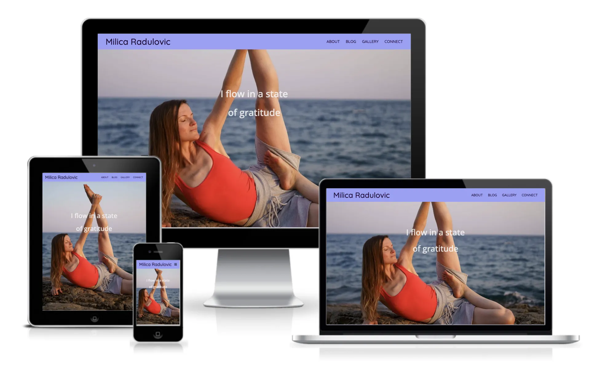
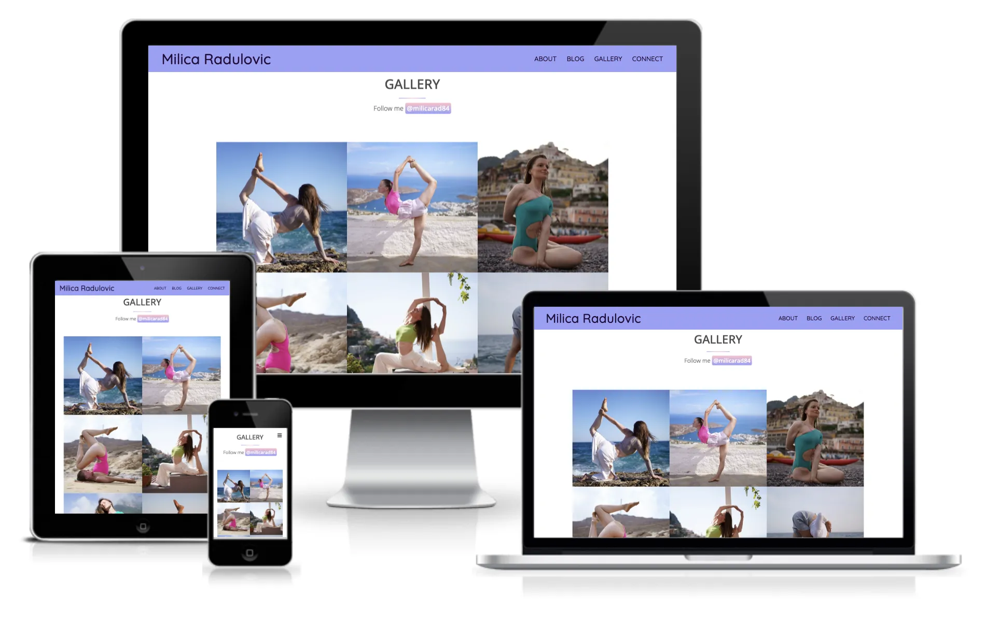

# Milica Radulovic - My Yoga Adventure


[Milica Radulovic - My Yoga Adventure](https://radule90.github.io/CI_PP_1/) website is set up as a personal yoga travel blog, where users can learn more about Milica and her love for yoga, and travel and connect. In terms of appearance, I tried to keep a minimalistic look with little detail that will embellish the site for visitors.


***
## Table of Contents
1. <details>
    <summary><a href="#ux">UX</a></summary>

      - [Visitor Goals](#visitor-goals)
      - [Business Goals](#business-goals)
      - [User Stories](#user-stories)

</details>

2. <details>
    <summary><a href="#visual-design">Visual Design</a></summary>

      - [Wireframes](#wireframes)
      - [Colors](#colors)
      - [Fonts](#fonts)
      - [Icons](#icons)
      - [Images](#images)

</details>

3. <details>
    <summary><a href="#styling-and-formating">Styling and Formating</a></summary>

      - [Header Section](#header-section)
      - [About Section](#about-section)
      - [Blog Section](#blog-section)
      - [Gallery Section](#gallery-section)
      - [Connect Section](#connect-section)
      - [Footer Section](#footer-section)
      - [HTTP 404 Page](#http-404-page)

</details>

4. <details>
    <summary><a href="#validation-and-testing">Validation and Testing</a></summary>
    <ul>
    <li><a href="#html-validation">HTML Validation</a></li>
    <li><a href="#css-validation">CSS Validation</a></li>
    <li><a href="#accessibility">Accessibility</a></li>
    <li>
      <details>
      <summary><a href="#testing">Testing</a></summary>

      - [General Testing](#general-testing)
      - [Desktop Testing](#desktop-testing)
      - [Mobile](#mobile-testing)

      </details>
    </li>
    <li>
      <details>
      <summary><a href="#bugs">Bugs</a></summary>
      
      - [Fixed Bugs](#fixed-bugs)
      - [Unfixed Bugs](#unfixed-bugs-partialy-fixed)
      </details>
    </li>
    </ul>    

</details>
  
5. <a href="#deployment">Deployment</a> 
6. <a href="#credits">Credits</a>
7. <a href="#tools-and-platforms">Tools and Platforms</a>
8. <a href="#content">Content</a>
9. <a href="#media">Media</a>


***
## UX
### Visitor Goals
Target audience for this website:  
- Yoga lovers
- People who want to share yoga experiences and connect
- The traveler blog lovers
- Adventurous people who like to travel

User goals are:
- They get to know the owner of the site and her passion for yoga
- View a gallery of different yoga pose images
- To connect with the site owner and share the yoga experience
- To have fun reading a travelogue

### Business Goals
The Business Goals of this website: 
- Well this site does not have a business goal, it is more for presentation
- Getting to know each other
- Socializing
- Yoga promotion

### User Stories
- As user who is interested in yoga and traveling, I expect to see/read: 
  - Photos of different yoga poses on interesting destinations
  - Interesting articles about yoga journey
  - Easly to get in contact to share experience, per email or social networks

***
## Visual Design
### Wireframes
Initial [Wireframes]() can be found here.

### Colors
- For the base color, a shade of purple was chosen, a nice color that corresponds to the theme of the site.
- For the color of the letters, a shade of dark gray was chosen because it is not as intense as pure black, it has a more pleasant appearance and does not hinder readability and accessibility.
For the color of the letters, a shade of dark gray was chosen because it is not as intense as pure black, it has a more pleasant appearance and does not hinder readability and accessibility.
- Colour contrast was first verified on [WebAIM](https://webaim.org/resources/contrastchecker/).  


### Fonts
- I chose the font Open Sans, sans-serif letterform font from [Google Fonts](https://fonts.google.com), due to its clean appearance and readability, but it is not too serious for a website of this type.  

- Quicksand, also sans-serif letterform from [Google Fonts](https://fonts.google.com), alone to emphasize the specificity of the navigation bar without disturbing the appearance of the rest of the website.  


### Icons
- I have used [ICONS8](https://icons8.de) as a source for the decorative icons on the site, and adjusted the colors for website. Icons were selected that I thought complement the look of the website and do not disturb its essence.  

- I have used [Font Awsome](https://fontawesome.com) for social media.  


### Images
- Images are a very important part of this site, because the theme of the site is yoga journey.
- All photos are the property of Milica Radulovic.
- I converted the images to [WebP](https://developers.google.com/speed/webp) format. After installing the libwep codec, the photos were converted in terminal with a command:

```sh
cwebp [options] -q input_file -o output_file.webp
```

***
## Styling and Formating
- In HTML I have used semantic elements in appropriate places and HTML entities. Whereas I used div (non-semantic) elements as container for decorative images and for positioning.
- Some time ago I came across this one [Write better CSS using logical properties](https://www.youtube.com/watch?v=kzvmaVik4mA), and because of the recommendation I started using logical properties.
- I did most of the positioning with Flexbox (learnd at [CSS-Tricks](https://css-tricks.com/snippets/css/a-guide-to-flexbox/)), while I feel comfortable working with it.
- For embellishment and a kind of interactivity, I applied the transform property with the function scale ([Code Institute - Love Running Project](https://codeinstitute.net/de/)) and skew function ([MDN](https://developer.mozilla.org/en-US/docs/Web/CSS/transform-function/skew)) in several places.

### Header Section
- The background image over the entire viewport seemed to me to be a fairly nice solution, because the user immediately gets to know the person whose journey they are going to read about.
- I also add the transparent mask to navigation bar in order to improve readability.  


### About Section
- The heading is aligned left on purpose because the text is directly related to it and represents the whole.
- I used a light shade of purple as the background color, because it seemed calming and relaxing and in line with the images and theme of the site.
- The font color is a shade of gray and contrast with background-color is checkd with [WebAIM](https://webaim.org/resources/contrastchecker/).
- As an addition to the text, there is a firelog pose icon from [ICONS8](https://icons8.de). a decoration that fits in with the rest.

- I kept most of that concept as well through the blog section of the site.
- Next comes image and is set as background with attachment proporty to fixed, in order to create an effect similar to [Parallax Scrolling](https://www.w3schools.com/howto/howto_css_parallax.asp) ([iOS Devices Bug](#bugs)).  


### Blog Section
- I used a slightly modified concept in this section. I didn't want to deviate too much because these two are similar, they have a lot of text and images.
- Between articles there are background images that also represent the demarcation between different sections and articles.


### Gallery Section
- I decided for a white background in the next two sections of the site, in order to avoid monotony and make it clear to the user that the part of the site is finished (let's call it the "text part of the site") and the sections related to social networks and contact begin.
I used [W3Schools](https://www.w3schools.com/css/css3_flexbox_responsive.asp) code of the gallery to adapt it to the requiremnets of the project.
- The gallery is responsive. I decided that two columns should be displayed on small screens and three on large screens. I achieved this by setting the display of the last column container to none and using @media for a minimum width of 768px to display it again.
- I added the instagram button as a suggestion to the user that they can find more images on the instagram profile of site owner.  


### Connect Section
- This section is separated from the rest with a border line, applied border image property with linear gradient (researched on [MDN](https://developer.mozilla.org/en-US/docs/Web/CSS/border-image)), it seemed like a nice and simple solution for dividing sections with a white background.
- Then, I added a box shadow to make the shape stand out.
- The form has validation and is responsive.  


### Footer Section
- For this section i chose dark gray background color, at first I thought it should be a shade of purple, but however the site would become boring, this is how it suggests that this is the end of the site.
- I included a short copyright text in it.
- Arrow to return to the top of the page, and when hovered over it scales itself as a suggestion that this is the link.
- Also included are links to social networks and the colors are inverted on the hover as a hint that this is the link to the user.

### HTTP 404 Page
- As a small addition I designed and developed an 404 HTTP error page.
- I kept the header and footer of the main page, with minor changes.
- I didn't want to be it too complicated, because there should be a simple message on this page. Using the same color palette and fonts I added an error message card and an additional link to the main page.


- [Here you can find live site.]()

***
## Validation and Testing
### HTML Validation
- has been validated with [W3C Markup Validation Service](https://validator.w3.org).  


### CSS Validation
- has been validated with [W3C CSS Validation Service](https://jigsaw.w3.org/css-validator/) and auto-prefixed with [CSS Autoprefixer](https://autoprefixer.github.io/).  

(See more for [iOS Devices Bug](#bugs)

### Accessibility
- Color contrast was verified on [WebAIM](https://webaim.org/resources/contrastchecker/).  
- The following results were achieved on Chrome Lighthouse for mobile devices:

- The following results were achieved on Chrome Lighthouse for desktops:


### Testing
#### General Testing
- The site looks good on all common screen sizes, including 4k ([iOS Devices Bug](#bugs)).  
- The navigation bar, header, about, blog, connect and footer sections are all readable and understandable with working internal and external links.  
- The Connect form works, and requires input to every entry.  

#### Desktop Testing
- The site was tested on a macOS computer and performed very well
- It was tested on several Windows computers by acquaintances and friends, worked without error

#### Mobile Testing
- It has been successfully tested on multiple android devices and also on multiple virtual devices at [BrowserStack](https://www.browserstack.com/)
- There is a bug on iOS devices (Read more: [iOS Devices Bug](#bugs))

### Bugs
### Fixed Bugs
- Chrome was returning errors for manifest, so I found and applied [this solution](https://github.com/jantimon/favicons-webpack-plugin/issues/212)

### Unfixed Bugs (Partialy Fixed)
- Proporty background-attachment with value fixed does not work properly on iOS devices (iPads, iPhones). Tested with [BrowserStack](https://www.browserstack.com/).
 
  - Possible solutions 
    - The solution that is to change the value of    background-attachment to scroll for mobile phones and tablets sizes ([W3Schools](https://www.w3schools.com/howto/howto_css_parallax.asp)). But I didn't want to implement this solution, because the page was displayed normally on Android and HarmonyOS devices.
    - Rory (mentor) referred me to [this article](https://www.browserstack.com/guide/create-browser-specific-css) on [BrowserStack](https://www.browserstack.com/) to try to come up with a solution. After applying the CSS code for browser recognition and testing on a certain number of iOS devices on [BrowserStack](https://www.browserstack.com/), the browser, Safari, was recognized and the `background-attachment: scroll;` property was applied to it and the site worked, the problem remained with older models. Although it is not the best solution and the way the code is structured for Safari compatibility, it causes the jigsaw test to show errors ([Look at CSS Validation](#css-validation)). Since I did not find that this error affects the operation on other devices, and the site works decently on newer ios devices I decided to implement it. In the future when I learn new technologies I will fix the bug.

***
## Deployment
This site was deployed through GitHub Pages using the following steps:
1. Sign in to the GitHub website.
2. In the GitHub project repository, navigate to the Settings tab, then choose Pages from the menu
3. From the Build and deployment section select Branch: main and then save.
4. After about a minute, refresh the page and under GitHub Pages you will see a link.

The live link can be found here: [Milica Radulovic - My Yoga Adventure](https://radule90.github.io/CI_PP_1/).

***
## Credits
- [Code Institute](https://codeinstitute.net/de/)
- Rory Patrick Sheridan (Mentor) - Great advice and guidance
- [Mozilla Developer Networks](https://developer.mozilla.org/en-US/) - Additional learning resources
- [W3Schools](https://www.w3schools.com) - Additional learning resources
- [CSS-Tricks](https://css-tricks.com) - Additional learning resources
- [Dave Gray](https://www.youtube.com/c/DaveGrayTeachesCode) - Additional learning resources
- [Kevin Powell](https://www.youtube.com/@KevinPowell) - Additional learning resources
- [BrowserStack](https://www.browserstack.com/) - Website Testing on iOS

***
## Tools and Platforms
- [Gitpod](https://gitpod.io/) - IDE for project development
- [Github](https://github.com/) - Storing code remotely and deployment
- [W3C Markup Validation Service](https://validator.w3.org)
- [W3C CSS Validation Service](https://jigsaw.w3.org/css-validator/)
- [CSS Autoprefixer](https://autoprefixer.github.io/)
- [Coolors.co](https://coolors.co/) - Palette generator
- [Balsamiq Wireframes](https://balsamiq.com/) - To create wireframes
- [WebAIM](https://webaim.org/resources/contrastchecker/) - Contrast checker
- [Mockup Generator](https://techsini.com/multi-mockup/index.php) - For device mockup images
- [Favicon Generator](https://www.favicon-generator.org/)
- [WebP](https://developers.google.com/speed/webp) - To convert images
- [BrowserStack](https://www.browserstack.com/) - Testing on different devices
- [Google Fonts](https://fonts.google.com)
- [ICONS8](https://icons8.de) - Decorative icons
- [Font Awsome](https://fontawesome.com) - Icons

***
## Content
- The base code for the "Parallax" Scrolling effect was taken from [W3Schools](https://www.w3schools.com/howto/howto_css_parallax.asp), and then adjusted for the needs of the site.
- The base code for the Gallery section was taken from [W3Schools](https://www.w3schools.com/css/css3_flexbox_responsive.asp), and then I adjusted it for the needs of the site.

***
## Media
- The images belong to Milica Radulovic
- Decorative icons are taken from [ICONS8](https://icons8.de)
- Icons for social networks are taken from [Font Awsome](https://fontawesome.com)